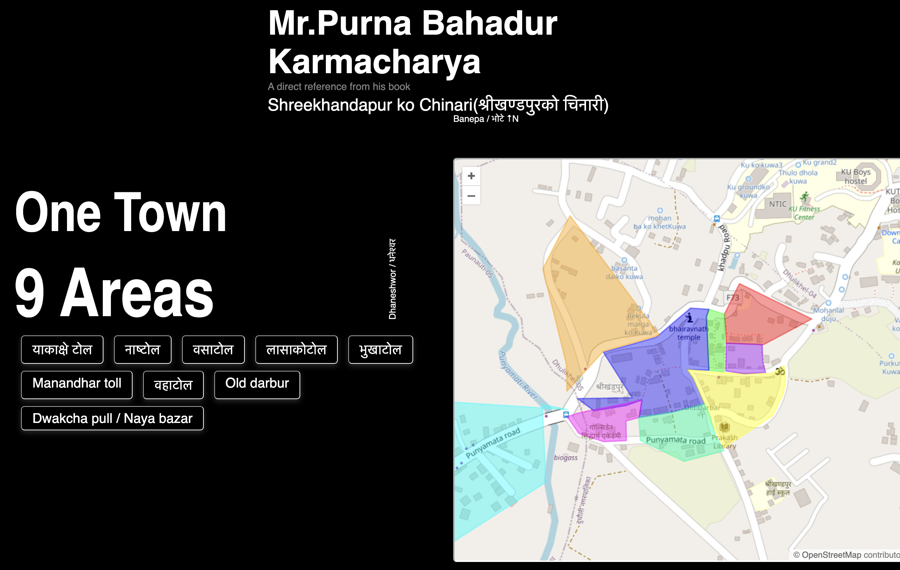
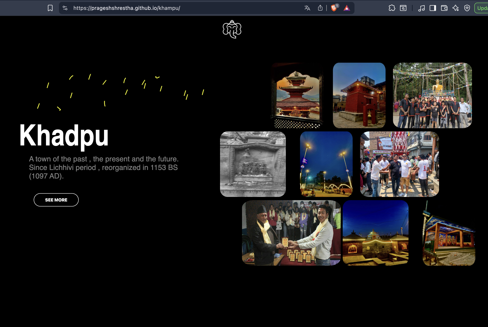

# 🌄 Project Khampu

Discover the Beauty of Khadpu town of Dhulikhel
A town of the past , the present and the future.
Since Lichhivi period , reorganized in 1153 BS
# (1097 AD).

[Visit the Info Site](https://prageshshrestha.github.io/khampu) for more details, maps, and resources!

Stunning views of Shree Swet Bhairab Temple

Hiti Culture 

Project Screenshots
Here are some captures from the Khampu info site:

  
  
  
